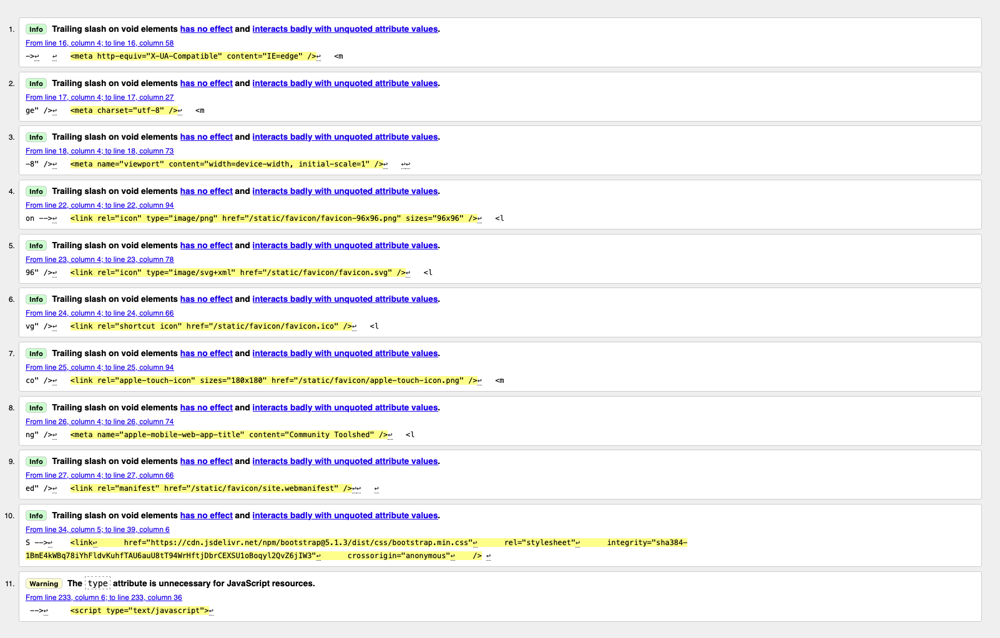
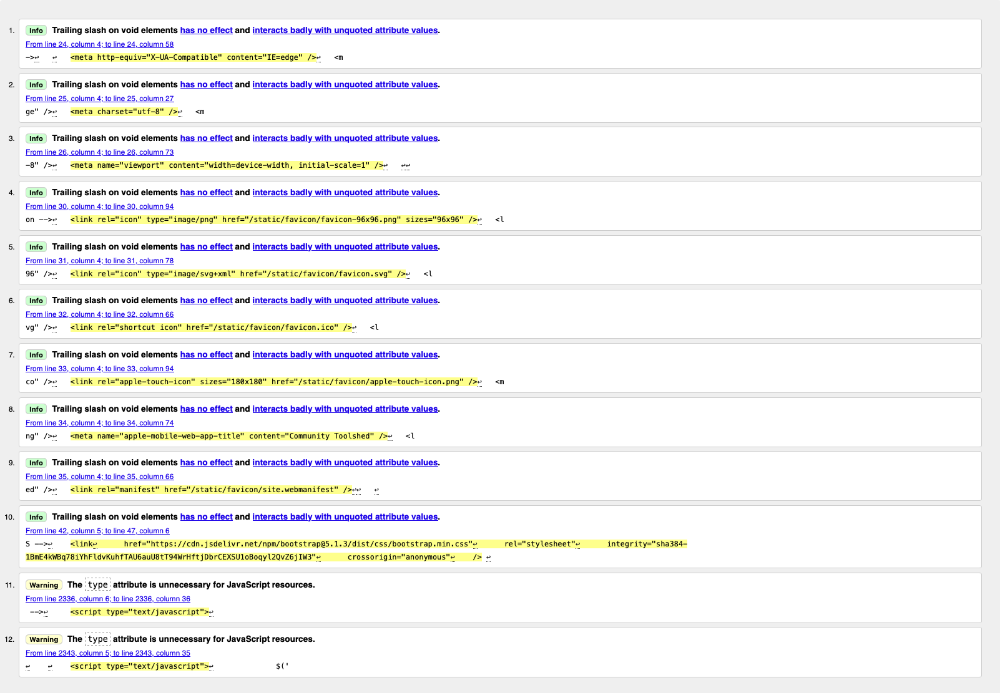

# Tests For Community Toolshed

## Table of Contents

1. [User Requirements](#user-requirements)  
    1.1 [Rent Tools](#1️⃣-rent-tools)  
    1.2 [Rent Party Items](#2️⃣-rent-party-items)  
    1.3 [Manage Membership and Subscription](#3️⃣-manage-membership-and-subscription)  
    1.4 [Secure Payments](#4️⃣-secure-payments)  
    1.5 [View and Manage Orders](#5️⃣-view-and-manage-orders)  
    1.6 [View Past Orders](#6️⃣-view-past-orders)  
    1.7 [Maintenance and Repairs](#7️⃣-maintenance-and-repairs)  
    1.8 [User Profile Management](#8️⃣-user-profile-management)  
    1.9 [Browse and Search Items](#9️⃣-browse-and-search-items)  
    1.10 [Responsive and Accessible Design](#🔟-responsive-and-accessible-design)  

2. [Full Manual Tests](#full-manual-tests)  

3. [Automated Tests](#automated-tests)  
    3.1 [HTML Validator](#html-validator)  
    3.2 [CSS Validator](#css-validator)  
    3.3 [Lighthouse Tests](#lighthouse-tests)  

## User Requirements

### 1️⃣ Rent Tools
**Requirement:** As a community member, I want to rent tools so that I can complete home improvement projects affordably.  
**Acceptance Criteria:**
- Users can browse available tools in the inventory.
- Users can select a tool and choose a rental period.
- Users can place an order for the tool (if available).
- Users receive confirmation of their order.
- Users can return the tool and report if it is broken or needs repair.

### 2️⃣ Rent Party Items
**Requirement:** As a party host, I want to rent party items so that I don’t have to buy disposable supplies.  
**Acceptance Criteria:**
- Users can browse available party items (plates, cups, cutlery, etc.).
- Users can select a quantity of party items to rent.
- Users can place an order for their event date.
- Users can report broken or unclean items upon return.
- Users receive confirmation of their order.

### 3️⃣ Manage Membership and Subscription
**Requirement:** As a subscriber, I want to manage my membership so that I can continue renting items without interruption.  
**Acceptance Criteria:**
- Users can subscribe and pay the $10 yearly fee.
- Users can view their subscription status (active/inactive).
- Users with an inactive subscription cannot rent items.

### 4️⃣ Secure Payments
**Requirement:** As a user, I want to securely pay for my subscription and rentals.  
**Acceptance Criteria:**
- Payments are processed securely using Stripe.
- Users receive confirmation of successful payments.
- Payment statuses are tracked (pending, paid, failed).

### 5️⃣ View and Manage Orders
**Requirement:** As a user, I want to view and manage my orders.  
**Acceptance Criteria:**
- Users can view their order history.
- Users can view the details of an individual order.
- Users can change the status of an order item (testing purposes).

### 6️⃣ View Past Orders
**Requirement:** As a user, I want to view a list of my past orders so that I can track my rental history.  
**Acceptance Criteria:**
- Users can access a page displaying a list of all their past orders.
- Users can click on an individual order to view its details.
- Users can see the rental period, items rented, and order status.

### 7️⃣ Maintenance and Repairs
**Requirement:** As a manager, I want to track and manage maintenance for tools.  
**Acceptance Criteria:**
- Users can report an item as needing maintenance.
- Managers can view all maintenance tickets.
- Managers can update the status of a maintenance ticket (pending, in_progress, fixed, written_off).
- Managers can create new maintenance tickets.

### 8️⃣ User Profile Management
**Requirement:** As a user, I want to manage my profile information.  
**Acceptance Criteria:**
- Users can view and update their profile information.
- Users can view their subscription status.
- Users can request verification of their account.

### 9️⃣ Browse and Search Items
**Requirement:** As a user, I want to browse and search for items easily.  
**Acceptance Criteria:**
- Users can browse all items available for rent.
- Users can filter items by category.
- Users can search for items by name.

### 🔟 Responsive and Accessible Design
**Requirement:** As a user, I want the website to be responsive and accessible across devices.  
**Acceptance Criteria:**
- The website is fully responsive and works on desktop, tablet, and mobile devices.
- All buttons and inputs have hover and focus effects.
- Text has high contrast for readability.
- Users receive confirmation, error, or information messages as needed.

## Full Manual Tests

| **Test ID** | **Feature**                     | **Test Description**                                                                 | **Expected Result**                                                                                     | **Pass/Fail** |
|-------------|---------------------------------|-------------------------------------------------------------------------------------|---------------------------------------------------------------------------------------------------------|---------------|
| 1           | Sign Up                        | Create a new user account.                                                     | User account is created successfully, and a confirmation email is sent.                                | Pass           |
| 2           | Email Confirmation             | Confirm the email address using the link sent to the user's email.             | Email is confirmed, and the user can log in.                                                            |    Pass       |
| 3           | Sign In                        | Log in with valid credentials.                                                 | User is logged in successfully and redirected to the homepage.                                          |        Pass   |
| 4           | Sign In                        | Attempt to log in with invalid credentials.                                    | Login fails, and an error message is displayed.                                                         |      Pass     |
| 5           | Logout                         | Log out of the platform.                                                       | User is logged out successfully and redirected to the homepage.                                         |      Pass     |
| 6           | Browse Tools                   | Browse available tools in the inventory.                                       | Tools are displayed with details such as name, availability, and rental price.                         |       Pass    |
| 7           | Browse Tools                   | Select a tool and choose a rental period.                                      | Tool can be selected, and rental period can be specified.                                               |      Pass    |
| 8           | Browse Party Items             | Browse available party items in the inventory.                                 | Party items are displayed with details such as name, availability, and rental price.                   |       Pass    |
| 9           | Browse Party Items             | Select a quantity of party items and choose a rental period.                   | Quantity and rental period can be specified.                                                           |       Pass    |
| 10          | Browse and Search Items        | Browse all items available for rent.                                           | All items are displayed with appropriate filters and sorting options.                                   |      Pass     |
| 11          | Browse and Search Items        | Search for items by name.                                                      | Search results display items matching the search query.                                                 |      Pass    |
| 12          | Set Rental Dates               | Set a start and end date for renting a tool or party item.                     | Start and end dates are successfully set, and availability is checked.                                 |       Pass    |
| 13          | Add Items to Cart              | Add a tool or party item to the cart.                                          | Item is added to the cart, and the cart page is updated with the correct details.                       |      Pass     |
| 14          | View Cart                      | View the cart with all added items.                                            | Cart displays all items with correct details, including rental dates, quantities, and prices.           |      Pass     |
| 15          | Edit Cart Quantity             | Adjust the quantity of items in the cart.                                      | Cart updates the quantities, and the total price is recalculated.                                       |      Pass     |
| 16          | Delete Cart Item               | Remove an item from the cart.                                                  | Item is removed from the cart, and the cart page is updated.                                            |      Pass     |
| 17          | Checkout Cart                  | Proceed to the checkout page from the cart.                                    | User is redirected to the checkout page, and the cart details are displayed for confirmation.           |      Pass     |
| 18          | Submit Payment                 | Submit payment for the cart using Stripe.                                      | Payment is processed securely, and the user is redirected to the order confirmation page.               |      Pass     |
| 19          | Stripe Integration             | Test Stripe webhook for successful payments.                                   | Webhook updates the payment status to "Paid" and sends a confirmation email.                            |      Pass     |
| 20          | Stripe Integration             | Test Stripe webhook for failed payments.                                       | Webhook updates the payment status to "Failed" and sends an error email.                                |      Pass     |
| 21          | Order Confirmation             | View the order confirmation page after successful payment.                     | Order confirmation page displays order details, including items, rental dates, and total price.         |      Pass     |
| 22          | View Past Orders               | Access a list of past orders from the profile page.                            | Past orders are displayed with details such as rental period, items rented, and order status.           |      Pass     |
| 23          | View Individual Order          | View the details of an individual past order.                                  | Order details are displayed, including items, rental period, and status.                                |      Pass     |
| 24          | Manage Subscription            | Subscribe to the platform and pay the £10 yearly fee.                          | Subscription is successfully created, and payment is processed via Stripe.                              |      Pass     |
| 25          | Manage Subscription            | View subscription status (active/inactive).                                    | Subscription status is displayed correctly in the user profile.                                         |      Pass     |
| 26          | Manage Subscription            | Attempt to rent items with an inactive subscription.                           | User is prevented from renting items, and an appropriate error message is displayed.                   |       Pass    |
| 27          | Secure Payments                | Process a payment for a subscription or rental order using Stripe.             | Payment is processed securely, and confirmation is displayed.                                           |      Pass     |
| 28          | Secure Payments                | Test Stripe payment statuses (pending, paid, failed).                          | Payment statuses are updated correctly in the database.                                                 |      Pass     |
| 29          | Maintenance and Repairs        | Report an item as needing maintenance from a past order.                       | Add Maintenance ticket page is opened with the correct details filled in.                               |      Pass     |
| 30          | Maintenance and Repairs        | Managers view all active maintenance tickets.                                  | Active maintenance tickets are displayed in the "Active Tickets" table.                                 |      Pass     |
| 31          | Maintenance and Repairs        | Managers view all past maintenance tickets.                                    | Past maintenance tickets are displayed in the "Past Tickets" table.                                     |      Pass     |
| 32          | Maintenance and Repairs        | Managers update the status of a maintenance ticket.                            | Maintenance ticket status is updated correctly (e.g., pending, in_progress, fixed, written_off).        |      Pass     |
| 33          | Maintenance and Repairs        | Test the "Create Ticket" button on the maintenance page.                       | User is redirected to the ticket creation form.                                                         |      Pass     |
| 34          | Maintenance and Repairs        | Test the "Edit Ticket" button on the maintenance page.                         | User is redirected to the ticket editing form.                                                          |      Pass     |
| 35          | Maintenance and Repairs        | Test the "Complete Ticket" button on the maintenance page.                     | Ticket status is updated to "Completed," and the page is refreshed.                                     |      Pass     |
| 36          | Product Management             | Add a new tool from the product management page.                               | Tool is added successfully, and it appears in the product list.                                         |      Pass     |
| 37          | Product Management             | Add a new party item from the product management page.                         | Party item is added successfully, and it appears in the product list.                                   |      Pass     |
| 38          | Product Management             | Edit an existing tool from the product management page.                        | Tool details are updated successfully, and changes are reflected in the product list.                   |      Pass     |
| 39          | Product Management             | Delete a tool from the product management page.                                | Tool is deleted successfully, and it no longer appears in the product list.                             |      Pass     |
| 40          | Product Management             | View all orders and the status of items in the orders.                         | Orders and item statuses are displayed in the "Orders" section of the product management page.          |      Pass     |
| 41          | User Profile Management        | View and update profile information.                                           | Profile information is displayed and can be updated successfully.                                       |      Pass     |
| 42          | User Profile Management        | Request verification of the account.                                           | Verification request is submitted, and status is updated in the profile.                                |      Pass     |
| 43          | Responsive and Accessible Design | Test website responsiveness on desktop, tablet, and mobile devices.            | Website layout adjusts correctly for different screen sizes.                                            |    Pass       |
| 44          | Responsive and Accessible Design | Test hover and focus effects on buttons and inputs.                            | Buttons and inputs display hover and focus effects.                                                     |    Pass       |
| 45          | Responsive and Accessible Design | Test text contrast and readability.                                            | Text is readable with high contrast against the background.                                             |    Pass       |
| 46          | Defensive Design               | Attempt to access restricted pages without logging in.                         | User is redirected to the login page with an appropriate error message.                                 |      Pass     |
| 47          | Defensive Design               | Attempt to rent items without being verified.                                  | User is prevented from renting items, and an appropriate error message is displayed.                   |       Pass    |
| 48          | Buttons and Links              | Test all navigation links in the navbar.                                       | Links navigate to the correct pages (e.g., Home, Cart, Profile, Logout).                                |      Pass     |
| 49          | Buttons and Links              | Test all buttons on the product management page.                               | Buttons perform the correct actions (e.g., Add Tool, Edit Tool, Delete Tool).                           |      Pass     |
| 50          | Buttons and Links              | Test the "Add to Cart" button on individual item pages.                        | Item is added to the cart, and the cart page is updated.                                                |      Pass     |
| 51          | Buttons and Links              | Test the "Remove" button on the cart page.                                     | Item is removed from the cart, and the cart page is updated.                                            |      Pass     |
| 52          | Buttons and Links              | Test the "Checkout" button on the cart page.                                   | User is redirected to the checkout page.                                                                |      Pass     |
| 53          | Buttons and Links              | Test the "Submit Payment" button on the checkout page.                         | Payment is processed, and the user is redirected to the success page.                                   |      Pass     |
| 54          | Buttons and Links              | Test the "Create Subscription" button on the profile page.                     | User is redirected to the subscription checkout page.                                                   |      Pass     |

## Automated Tests

### HTML Validator

W3C validator was used to check the HTML code for errors.

The main pages were tested.

These tests were done by pasting the HTML source code from the inspector into the validator.

#### Home Page

No Errors

#### Products Page

No Errors

#### Product Detail Page

There are 2 errors, however these are due to the use of the "| safe" filter in Django to render the product description as HTML.

#### Profile Page

No Errors

#### Cart Page

No Errors

#### Product Management Page

No Errors

#### Maintenance Page

No Errors

### CSS Validator 

The CSS code was checked using the W3C CSS Validator.

The [base.css](community_toolshed/static/css/base.css) file was tested and no errors were found.

The [checkout.css](community_toolshed/checkout/static/css/checkout.css) file was tested and no errors were found.

### Lighthouse Tests

The test were run on the main pages accessed by a normal user of the website on a live deployment.

The fact that the website is hosted on Heroku and uses a free dyno, the performance score is lower than expected.

Also the AWS S3 bucket also affects the performance score. As does the use of the Django templating language and the bootstrap framework.

Overall the Accessibility and SEO scores are really good, however the other scores can be improved in certain pages.

#### Home Page

| Mobile | Desktop |
|--------|---------|
|  |  |

This page has a good performance score. I believe this is due to the fact that it is a simple page with no database queries.

#### Products Page

| Mobile | Desktop |
|--------|---------|
|  |  |

This page has a pretty low score on mobile. I think this is due to the size of the images

#### Product Detail Page

| Mobile | Desktop |
|--------|---------|
|  |  |

The page also has a low score on mobile. This is due to the size of the images and possible the "| safe" filter used to render the product description as HTML.

#### Profile Page

| Mobile | Desktop |
|--------|---------|
|  |  |

The score is not great on mobile or desktop on this page. I think this is due to the fact that the page is quite complex and has a lot of database queries. I could improve this by using caching and improving how I handle the queries in the view.

#### Cart Page

| Mobile | Desktop |
|--------|---------|
|  |  |

Here again the mobile score is significantly lower than the desktop score. This could be due to the size of the images and the fact that the page is quite complex.